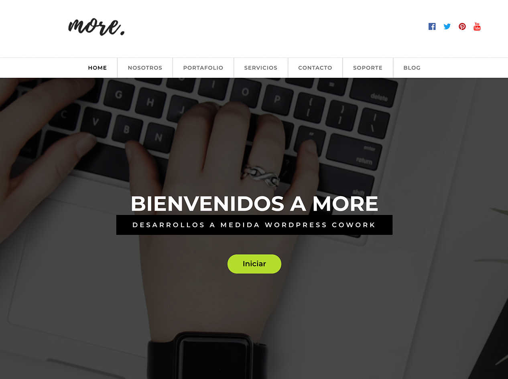

# Producción Web Mobile 

## De página estática a tema de WordPress



En esta actividad vamos a llevar un sitio HTML a Themes, pasándola de una página estática con bootstrap y Jquery a un tema funcional de WordPress que incluya estas características.

La idea es que al final de esta evaluación puedas transformar cualquier página estática en un tema de WordPress.
 
### Antes de empezar

- Para poder realizar esta actividad debes revizar el material de la siguiente URL <https://github.com/abecerraguz/THEMES-WP-00>

**Comencemos**

### Instrucciones Generales:

La evaluación del Desarrollo Ejercicio Sitio More se realizará en dos partes, las Fechas son:

-Viernes 12 de Julio, Nota Nº 3, 20% 

-Viernes 19 de Julio, Nota Nº 4, 30% 

### Instrucciones Específicas Evaluación Nº3 20%:

- Descarga WordPress desde <https://www.wordpress.org/>.
> Hint: Descargar HTML para trabajar THEMES [https://drive.google.com/file/d/1b3nM58QzpEBOTiJPn01dU1ezQXO0S9lX/view?usp=sharing](https://drive.google.com/file/d/1b3nM58QzpEBOTiJPn01dU1ezQXO0S9lX/view?usp=sharing)

- Instala en Local WordPress, Luego crear a traves de PhpMyAdmin, `Nombre de la Base de datos`, `Usuario de la base de datos`, `Contraseña`. Incorporar al archivo `wp-install.php`.

- Crea una carpeta para el tema dentro de la instalación WordPress.

- Abre la carpeta que creaste con tu editor de texto favorito.

- Crea los archivos `style.css (Con su Meta información requerida)`, `index.php`, `functions.php`, `screenshot.png`.

- Realiza las llamadas `<?php bloginfo('string');?>`, para recuperar la meta información de la página, `<title></title>`, `<meta name="description" content="Descripción de la página">` 

	-	Hint: Para cambiar la dirección de las imágenes y cualquier recurso que este alojado en una carpeta , usa el siguiente código como referencia:

		```php 
		/img/lorem-ipsum.png">
		```
	
	-	Hint: Para realizar la vinculación de la hoja de estilo de la raiz del themes:

	```php 
		 <link rel="stylesheet" href="<?php bloginfo('stylesheet_url')?>">
	```

### A continuación:	

- Ingresa la información del sitio html al admin de worpress, en la seccción de las páginas `Home`, `Nosotros`, `Portafolio`, `Servicios`, `Contacto`, `Soporte`, `Blog` dentro de la sección páginas.
- Crea 3 entradas en las (Publicaciones o Post) de la sección `Servicios`, asociado a la categoría `Servicios`.
- Crea 3 entradas en las (Publicaciones o Post) de la sección `Actualidad`, asociado a la categoría `Actualidad`.
- Activar desde el archivo `functions.php` las imagenes destacadas (add_theme_support).

### THEMES FINAL EVALUACIÓN Nº3
~~~
	-wp-content/themes/themes-02-more-master
	|
	|– index.php  
	|– style.css
	|– screenshot.png
	|– function.php
~~~


## Instrucciones Específicas Evaluación Nº4 30%:

-Incorporar en el `index.php` include del `header.php`, e include del `footer.php`.

-Incorporar el `header hook`  y el `footer hook`.

-Incoporar en el `index.php` Post_type, para recuperar la información de los `post`.

-Incoporar en el `index.php` Post_type, para recuperar la información del `post_type`,`slider`.

-Crear el `post_type` `slider`.

-A partir del `index.php` debe crear `single.php`, `page.php`.

-A partir del `single.php`, `page.php` crear sus respectivas plantillas, no olvidar los cometarios para distintas plantillas , minimo una de cada una.

### THEMES FINAL EVALUACIÓN Nº4
~~~
	-wp-content/themes/themes-02-more-master
	|
	|---|--images/
	|	|--img.jpg
	|	|--img.png
	|	|--img.gif
	|
	|--js/
	|	|--___.js
	|	|--___.js
	|	|--___.js
	|
	|--css/
	|	|--___.css
	|	|--___.css
	|	|--___.css
	|
	|– index.php  
	|– style.css
	|– screenshot.png
	|– function.php
	|– header.php
	|– footer.php
	|– single.php
	|– single-blog.php
	|– page.php
	|– page-servicios.php
	|– css

~~~


